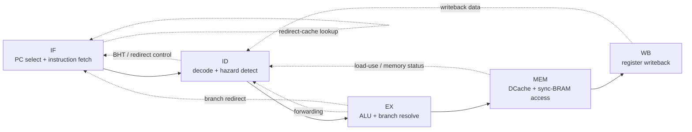
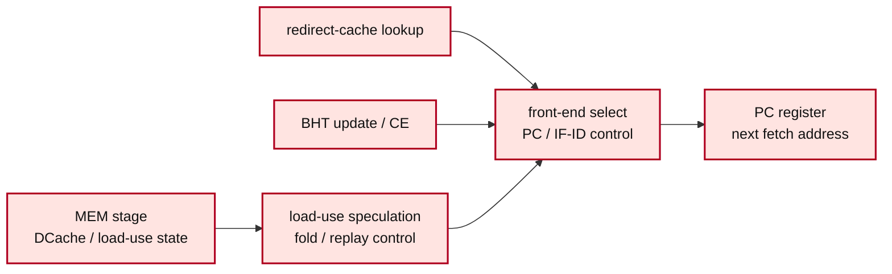
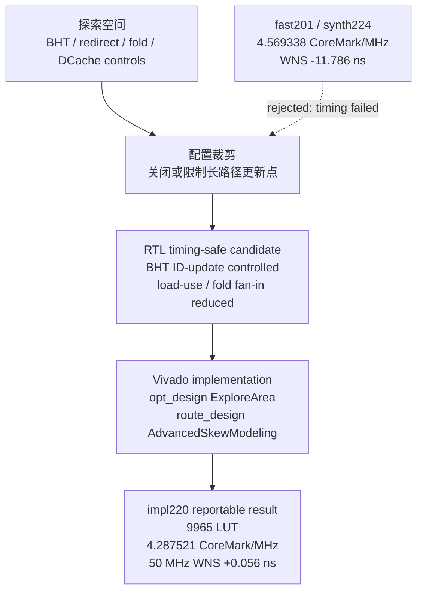
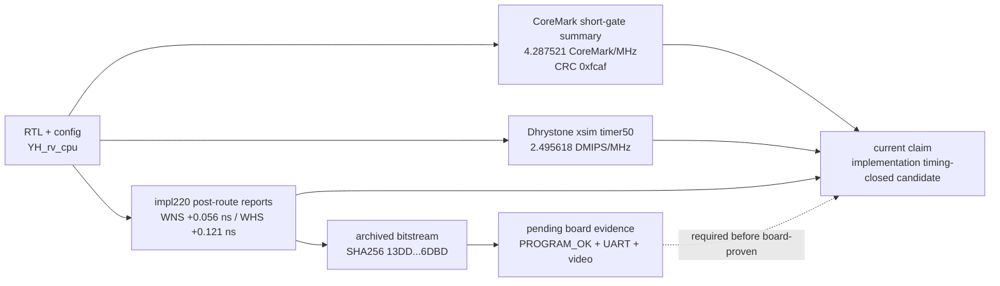

# strict50 架构与时序图 2026-07-03

本文档提供当前 `impl220` strict 50 MHz 工程候选的报告/PPT 可用图。图中只描述当前可报告主线：PYNQ-Z2、RV32 五级流水、strict sync-BRAM、post-route timing-closed implementation evidence。不要把历史 timing-failed 或旧 board-proven 口径混入这些图。

## 1. 五级流水与控制路径总览

用途：技术报告“CPU 微结构”章节、答辩 PPT“架构总览”页。

讲解要点：

- 主流水是 IF、ID、EX、MEM、WB 五级。
- 数据冒险主要由 forwarding、load-use stall/forward、WB 回写闭环处理。
- 控制冒险集中在 branch redirect、BHT、redirect-cache、fold/next-cache 相关控制。
- strict50 口径保留同步 BRAM 读延迟，不使用零延迟存储器模型换取虚高分数。

## 2. 时序热点形成机制

用途：技术报告“时序热点与优化动机”、答辩 PPT“时序问题定位”页。

讲解要点：

- 历史高分探索会把 MEM/DCache/load-use、redirect-cache、BHT 更新和前端 PC 选择放在同周期组合路径中。
- 这类路径可以提高 short-gate 分数，但容易在 50 MHz synthesis/implementation 中暴露长组合路径。
- 当前 `impl220` 的优化目标是缩短硬件关键路径，而不是修改 benchmark 软件。

## 3. 当前 `impl220` 的时序收敛取舍

用途：解释为什么当前主结果不是最高 fast score，而是 post-route timing-closed 候选。

讲解要点：

- `ENABLE_BRANCH_BHT_ID_UPDATE` 使 BHT ID 阶段更新从固定热点变成可配置路径。
- redirect/fold/next-cache 路径以 timing-safe 为第一约束，避免重建 MEM 到前端的长组合扇入。
- `ExploreArea + AdvancedSkewModeling` 是实现收敛策略，报告中必须和 RTL 取舍一起说明。
- 高分但 timing-failed 的结果只能作为审计过程，不能作为当前 FPGA 原型系统指标。

## 4. strict50 证据链

用途：报告/PPT 的“可复核性”和“合规边界”页。

讲解要点：

- 当前可报告主指标来自 implementation reports、CoreMark summary、Dhrystone xsim 和 bitstream manifest。
- `PROGRAM_OK`、board UART、board video 仍未完成，因此不能称 board-proven。
- CoreMark 核心算法文件未修改；当前 CoreMark 是工程 short-gate，不称官方 EEMBC 10 秒结果。

## 5. PPT 放图建议

| PPT 页 | 推荐图 | 说明 |
|---|---|---|
| 3 架构总览 | 图 1 | 作为处理器总体微结构图 |
| 5 时序热点 | 图 2 | 解释为什么 50 MHz 难点在同周期组合扇入 |
| 6 关键优化 | 图 3 | 解释 `impl220` 的取舍和 rejected 高分结果 |
| 9 合规边界 | 图 4 | 说明证据链和 board-proven 边界 |

## 6. 报告引用建议

报告中建议使用下面口径：

`当前架构图和时序热点图描述的是 impl220 strict 50 MHz post-route timing-closed engineering candidate。图中 board evidence 节点仍为 pending，只有 PROGRAM_OK、UART raw log 和视频补齐后，才能把当前 candidate 提升为 board-proven result。`
